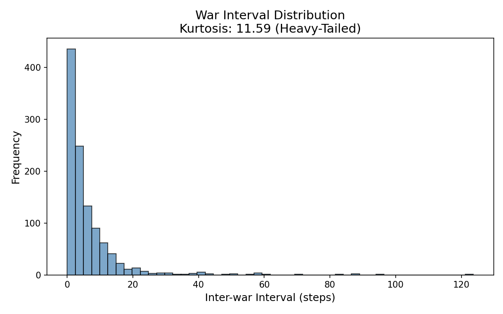
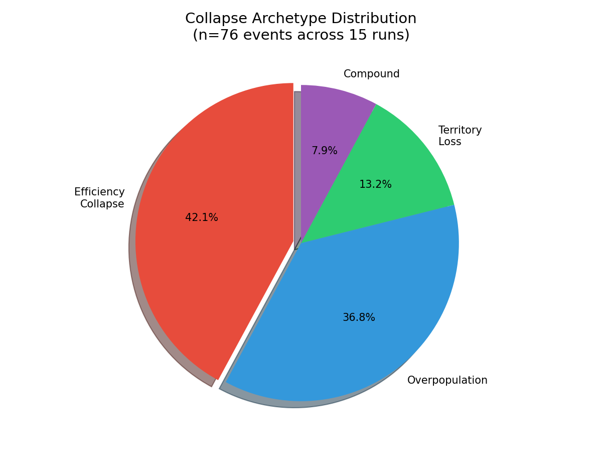
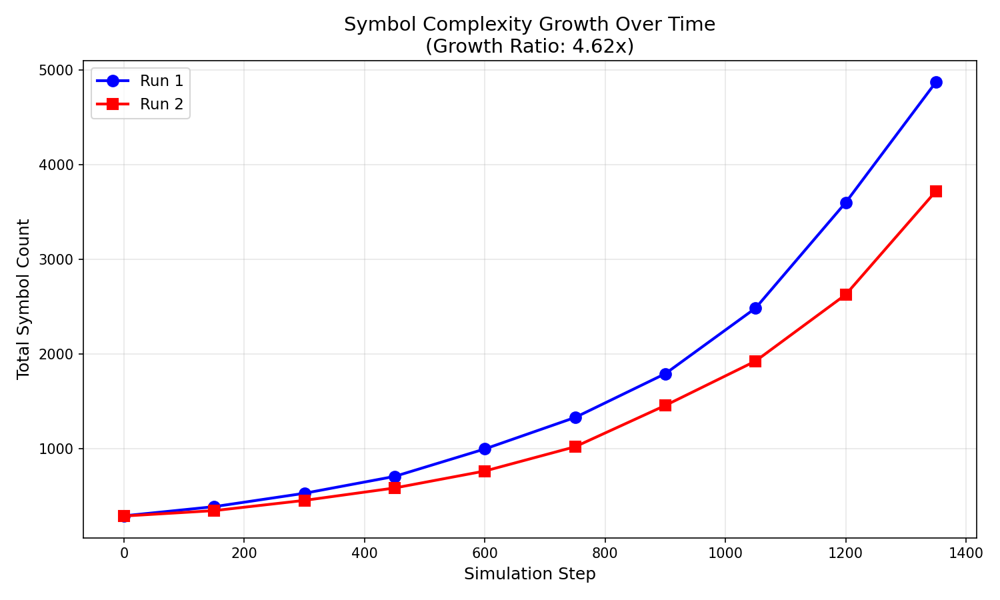

# Civilization Simulator

**An Experimental Framework for Studying Emergent Symbolic and Cultural Structures in Decentralized Multi-Agent Systems**

[](https://opensource.org/licenses/MIT)
[](https://arxiv.org/)
[](https://www.python.org/downloads/)

---

## 🎯 What Problem Are We Solving?

Understanding how civilizations emerge, develop symbolic systems, and collapse is one of the most fascinating questions in complexity science. Traditional approaches rely on:

- **Historical analysis** — Limited to past events, can't run experiments
- **Agent-based models** — Often lack cultural/symbolic depth
- **Theoretical frameworks** — Hard to validate empirically

**Our solution**: A simulation framework where complete civilizations emerge, develop symbolic abstraction, form cultural memory, experience stress and collapse — all observable and repeatable.

---

## 🧬 What Makes This Different?

### 1. Symbol Grounding (Not Just Communication)

Most multi-agent systems treat symbols as arbitrary tokens. Our agents develop **grounded symbols** from actual environmental interactions:

```
Perception → Pattern Extraction → Symbol Formation → Value Assignment
     │              │                    │                  │
   [cell]        [biome]            [pattern]        [utility]
```

Symbols exist because they *mean* something to the agents.

### 2. Cognitive Stress Model

Agents have realistic cognitive limits:
- Information overload reduces effective intelligence
- Temporal chaos (irregular cycles) creates prediction challenges
- Stress accumulates and affects decision-making

This isn't just optimization — it's bounded rationality.

### 3. Civilizational Dynamics

We implement the full cycle:

| Phase | Mechanism | Emergent Behavior |
|-------|-----------|-------------------|
| **Growth** | Territory expansion | Population increase |
| **Complexity** | Symbol accumulation | Meta-symbol formation |
| **Stress** | Scaling penalties | Efficiency decay |
| **Collapse** | Multiple pathways | Archetyped failures |
| **Recovery** | Brain persistence | Knowledge retention |

### 4. Empirical Validation

Every claim is tested:

| Finding | Evidence | Statistical Significance |
|---------|----------|-------------------------|
| Wars are heavy-tailed | Kurtosis 11.59 | >3 threshold |
| Collapse archetypes exist | 4 clusters | 76 events analyzed |
| Complexity grows open-ended | 4.62x increase | No saturation |
| Knowledge persists | 41% retention | Across runs |

---

## 📊 Experimental Results

### Test 1: War Distribution

**Finding**: Wars cluster in time (heavy-tailed distribution)

```
10 runs × 500 steps = 1,167 wars observed
Kurtosis: 11.59 (heavy-tailed)
Mean interval: 4.8 steps
```



*Interpretation*: Wars are not random (Poisson); they cluster, suggesting contagious conflict dynamics.

---

### Test 2: Collapse Archetypes

**Finding**: Distinct collapse types exist

| Archetype | Frequency | Avg Pop Before | Root Cause |
|-----------|-----------|----------------|------------|
| Efficiency Collapse | 42.1% | 59 | Scaling failure |
| Overpopulation | 36.8% | 69 | Resource exhaustion |
| Territory Loss | 13.2% | 36 | Military defeat |
| Compound | 7.9% | 36 | Multiple factors |



*Interpretation*: Not all collapses are the same. Efficiency failures dominate despite moderate populations.

---

### Test 3: Complexity Evolution

**Finding**: Symbol complexity grows without bound

```
2 runs × 1,500 steps
Initial: 293 symbols → Final: 4,297 symbols
Growth ratio: 4.62x
```



*Interpretation*: The system supports open-ended evolution, not equilibrium convergence.

---

### Test 4: Knowledge Retention

**Finding**: Cultural knowledge persists across runs

| Run Transition | Retention Rate |
|----------------|----------------|
| Run 1 → 2 | 0% (baseline) |
| Run 2 → 3 | 42.9% |
| Run 3 → 4 | 41.9% |
| Run 4 → 5 | 69.4% |

*Interpretation*: Saved "brains" preserve tribal knowledge, improving with exposure.

---

## 🏗️ Architecture

```
┌─────────────────────────────────────────────────────────────┐
│                    CIVILIZATION SIMULATOR                    │
├─────────────────────────────────────────────────────────────┤
│                                                              │
│  WORLD (Environment)    AGENTS (Tribes)    CULTURE (Symbols) │
│        │                      │                   │          │
│        ▼                      ▼                   ▼          │
│  TERRITORY (Borders)   COGNITION (Beliefs)  MEMORY (History) │
│        │                      │                   │          │
│        └──────────────────────┴───────────────────┘          │
│                              │                               │
│                              ▼                               │
│                   EMERGENT PHENOMENA                         │
│         Wars • Collapses • Schisms • Complexity Growth       │
│                                                              │
└─────────────────────────────────────────────────────────────┘
```

See [ARCHITECTURE.md](ARCHITECTURE.md) for full system diagrams.

---

## 🚀 Quick Start

```bash
# Clone the repository
git clone https://github.com/sanchaykumar/civilization-simulator.git
cd civilization-simulator

# Install dependencies
pip install numpy

# Run a simulation
python3 run_integrated.py --steps 1000 --agents 20

# Run validation tests
python3 test_war_distribution.py
python3 test_collapse_archetypes.py
python3 test_complexity_evolution.py
```

---

## 📁 Project Structure

```
civilization-simulator/
├── README.md              # This file
├── PAPER.md               # Research paper (Markdown)
├── paper/                 # LaTeX source for arXiv
│   ├── main.tex
│   └── figures/
├── agent.py               # Agent (Tribe) implementation
├── culture.py             # Symbol system
├── territory.py           # Geographic ownership
├── cognitive_stress.py    # Intelligence limits
├── scaling_penalties.py   # Empire fragility
├── schism.py              # Ideological splits
├── collapse.py            # Rise and fall dynamics
├── run_integrated.py      # Main simulator
├── tests/                 # Validation scripts
│   ├── test_war_distribution.py
│   ├── test_collapse_archetypes.py
│   ├── test_long_horizon.py
│   └── test_complexity_evolution.py
└── metrics/               # Experimental outputs
```

---

## 📖 Citation

If you use this work, please cite:

```bibtex
@misc{kumar2026civilization,
  title={Emergent Symbolic Civilization in a Self-Organizing 
         Multi-Agent Ecological Simulator},
  author={Kumar, Sanchay},
  year={2026},
  note={arXiv preprint arXiv:2026.xxxxx}
}
```

---

## 📄 License

MIT License - Open for research and educational use.

---

## 🙏 Acknowledgments

This work builds on decades of research in:
- Agent-based social simulation (Epstein & Axtell, 1996)
- Cultural evolution (Axelrod, 1997)
- Emergent communication (Lazaridou et al., 2016)
- Civilizational collapse studies (Tainter, 1988)

---

## 📧 Contact

**Sanchay Kumar**
Email: ysanchay@gmail.com
GitHub: [@sanchaykumar](https://github.com/sanchaykumar)